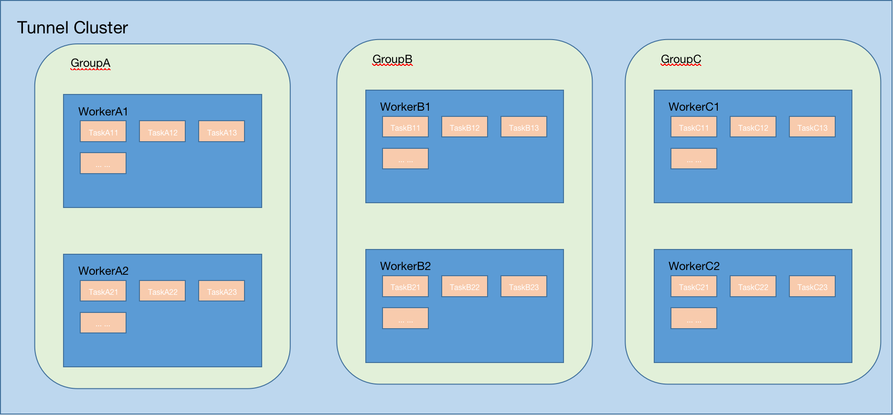

Tunnel
====
基于binlog的数据同步组件
----

# 产品介绍

# 系统部署架构


# 产品特性
- 集群采用 cluster-group-worker 三级架构部署模式，支持集群无限扩容，以Group为最小运维管理单元，多机房、多实例灵活部署。
- 采用 master-slave 部署模式，基于zk的分布式协调机制，故障自动转移、任务自动恢复，支持Task维度高可用。


# 注册中心节点设计

```shell 
-------
  |--tunnel
  |     |
  |     |--[cluster_code]
  |     |     |
  |     |     |--[group_code]
  |     |     |     |--election
  |     |     |     |     |(leader IP)  
  |     |     |     |
  |     |     |     |--nodes
  |     |     |     |     |--Node Ip1
  |     |     |     |     |--Node Ip2
  |     |     |     |     |--Node Ip3
  |     |     |     |     
  |     |     |     |--task
  |     |     |     |     |
  |     |     |     |     |-task_1
  |     |     |     |     |     |--position
  |     |     |     |     |          |(byte data，mysql Position数据)
  |     |     |     |     |
  |     |     |     |     |-task_2
  |     |     |     |     |     |--position
  |     |     |     |     |          |(byte data，mysql Position数据)
  |     |     |

```

# 数据模式

* **UPDATE**

```json
{
  "schema": "",
  "table": "xxx",
  "action": "update",
  "rows": [
    [
      {
        "column": "xx",
        "before": "xx",
        "after": "xx"
      },
      {
        "column": "xx2",
        "before": "xx",
        "after": "xx"
      }
    ],
    [
      {
        "column": "xx",
        "before": "xx",
        "after": "xx"
      },
      {
        "column": "xx2",
        "before": "xx",
        "after": "xx"
      }
    ]
  ]
}
```

* **INSERT**
```json
{
	"schema": "",
	"table": "xxx",
	"action": "insert",
	"rows": [
		[{
			"column": "xx",
			"value": "xx"
		}, {
			"column": "xx2",
			"value": "xx"
		}],
		[{
			"column": "xx",
			"value": "xx"
		}, {
			"column": "xx2",
			"value": "xx"
		}]
	]
}
```

* **DELETE**
```json
{
	"schema": "",
	"table": "xxx",
	"action": "delete",
	"rows": [
		[{
			"column": "xx",
			"value": "xx"
		}, {
			"column": "xx2",
			"value": "xx"
		}],
		[{
			"column": "xx",
			"value": "xx"
		}, {
			"column": "xx2",
			"value": "xx"
		}]
	]
}
```